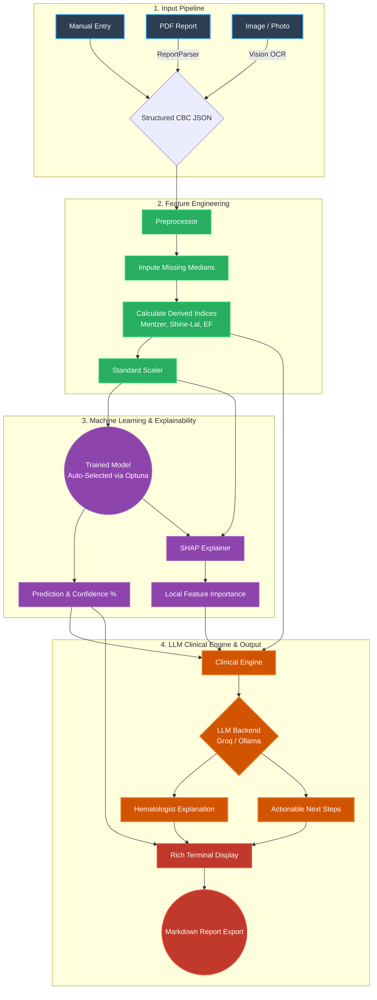

# HematoAI v3.0: End-to-End Methodology & Architecture

HematoAI is an Explainable AI Clinical Decision Support (CDS) system specifically designed for differentiating microcytic anemias (Iron Deficiency Anemia, Thalassemia Trait, and Anemia of Chronic Disease) using standard Complete Blood Count (CBC) data.

This document provides a comprehensive overview of the system's machine learning basics, model selection process, exploratory data analysis (EDA), feature importance tracking, and the end-to-end prediction pipeline.

## 1. Input Pipeline and Parsing

HematoAI handles three forms of input from healthcare providers:

1. **Manual Entry**: Users input CBC values directly via interactive terminal prompts. Basic biologic plausibility bounds are checked in real-time.
2. **PDF Lab Reports**: The system reads raw text from standard PDF lab reports and uses a specialized LLM prompt (via Groq/Ollama) to extract unstructured text into structured CBC JSON parameters.
3. **Image / Photo OCR**: Utilizing Vision Language Models (e.g., LLaVA or Llama-3.2-Vision), the application scans pictures of lab reports and securely extracts the relevant CBC markers.

*Handling Missing Data*: If any parameter is missing from the parsed input, the system automatically falls back to dataset medians (calculated during the training phase).

## 2. Preprocessing & Feature Engineering

Once the core CBC features (`Hb, MCV, MCH, MCHC, RBC, RDW, Hematocrit`) are secured, the **Preprocessor** enriches the data by calculating derived hematologic indices:
- **Mentzer Index** (MCV / RBC)
- **Shine-Lal** (MCV² × MCH / 100)
- **England-Fraser** (MCV - RBC - (5 × Hb))
- **RDW/MCV Ratio**
- **Hb/RBC Ratio**

These domain-specific indices give the ML model a massive boost in clinical accuracy, as they are proven mathematical heurists used by hematologists to differentiate anemias. 
All features (raw + derived) are then normalized using a `StandardScaler` fitted on the training dataset.

## 3. Machine Learning Models & Selection

HematoAI does not rely on a single hardcoded algorithm. Instead, it utilizes an **AutoML approach via Optuna** inside the `Trainer` module.

### Model Candidates
During training, the system evaluates several robust classifiers:
- **Random Forest**: Excellent for tabular data, resistant to overfitting.
- **XGBoost & LightGBM**: High-performance gradient boosting frameworks that handle non-linear relationships and imbalances well.
- **Support Vector Classifier (SVC)**
- **Logistic Regression** (baseline)

### Selection and Training
When a user initiates training (`hemo train`), Optuna runs a hyperparameter search across all candidates using **5-fold Stratified Cross-Validation**. The model that achieves the highest **Macro F1-Score** is selected. This ensures that minority classes are weighted equally and the model is robust across all three anemia types. The best model is then serialized along with its scaler and label encoder.

### Model Accuracy Tracking
The model's performance (F1-score, accuracy, dataset source, and feature count) is saved to a `metadata.json` file. This is prominently displayed in the CLI Header, so clinicians always know the exact reliability of the model they are utilizing.

## 4. SHAP (SHapley Additive exPlanations)

To prevent the "black box" problem common in ML, HematoAI integrates SHAP for explainability:
- **Local Explanations**: During a patient prediction, SHAP calculates the top influential features that drove the specific outcome (e.g., *MCV and Mentzer Index pushed the model towards Thalassemia*).
- **Global Explanations**: Accessible from the main menu, the system aggregates SHAP values across the entire dataset to show which features generally govern the model's logic.

## 5. Exploratory Data Analysis (EDA)

The integrated EDA module provides statistical and visual context to the dataset:
- Generates **Distribution Plots** and **Correlation Heatmaps** directly to the filesystem.
- Processes the aggregate statistics through the LLM to generate a **Hematologist Narrative**. This AI-generated report breaks down dataset quality and points out primary discriminating parameters (e.g., explaining why RDW is high in IDA but normal in Thalassemia).

## 6. End-to-End Prediction Flow

Once the model generates a classification, it is passed to the **Clinical Engine**. The Clinical Engine constructs a highly context-aware prompt containing:
1. Patient CBC & Derived Indices
2. Model Prediction & Confidence %
3. Top SHAP features (why the model made the choice)

The LLM consumes this and generates two pieces of text:
1. **Clinical Explanation**: A 3-sentence, jargon-free breakdown of why the CBC matches the prediction.
2. **Action Justification**: Recommended next steps, confirmatory tests (like Ferritin or Hemoglobin Electrophoresis), and red flags.

Finally, the Rich Terminal UI renders the output, and the user can export the complete diagnostic reasoning as a **Markdown document**.

## 7. Interpreting Visual Outputs

The system generates several visual files in the `outputs/` directory to help clinicians understand the underlying data and AI logic:

*   **CBC Distributions (`cbc_distributions.png`)**: 
    These are graphs that show how blood values (like Hemoglobin or MCV) are spread out across different patient groups. By using different colors for each anemia type, you can easily see where the groups overlap and where they differ. For example, it helps you visualize that Thalassemia patients often have higher RBC counts than Iron Deficiency patients.
*   **Correlation Heatmap (`correlation_heatmap.png`)**: 
    This is a color-coded grid that shows which blood markers "move together." If two markers have a high score, it means when one changes, the other usually changes in a predictable way (like MCV and MCH). This confirms that the AI is learning from real biological relationships.
*   **SHAP Summary (`shap_summary.png`)**: 
    This is the AI's "Reasoning Map." It ranks blood markers from most important to least important based on how much they influenced the final diagnosis. It shows you exactly which factors the AI is "looking at" most closely to make its decision, ensuring the process is transparent and trustworthy.

---

## Full Methodology Diagram

